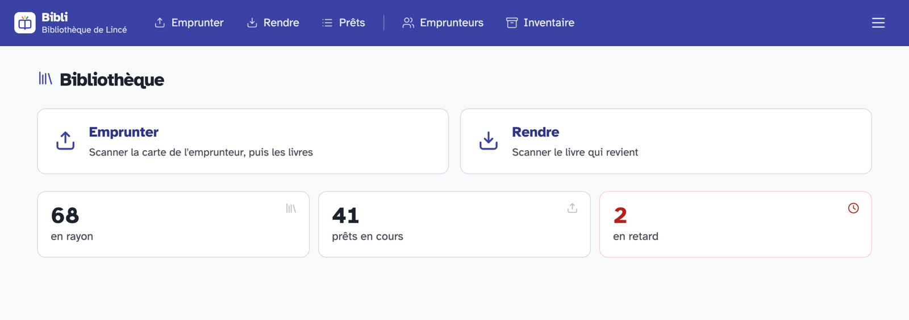
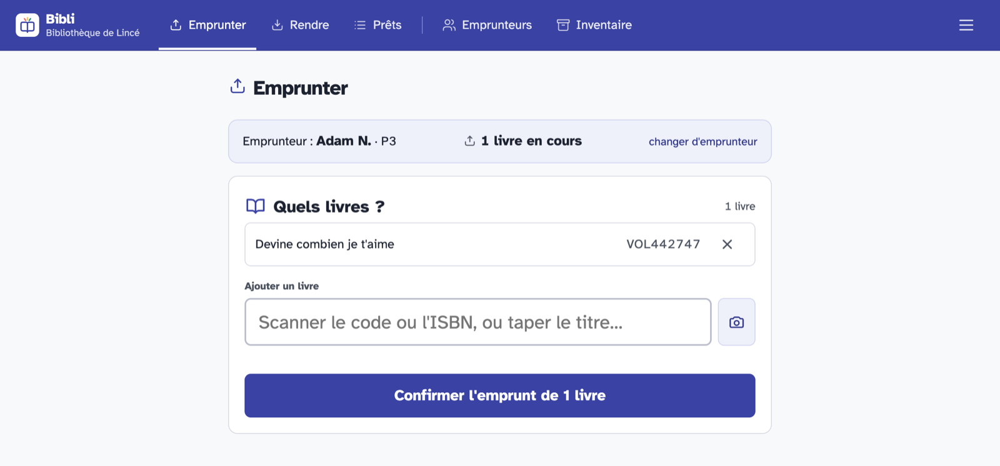
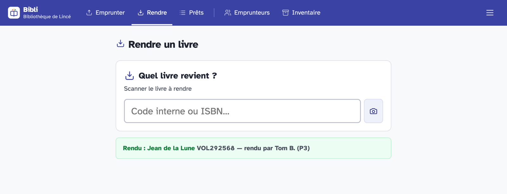
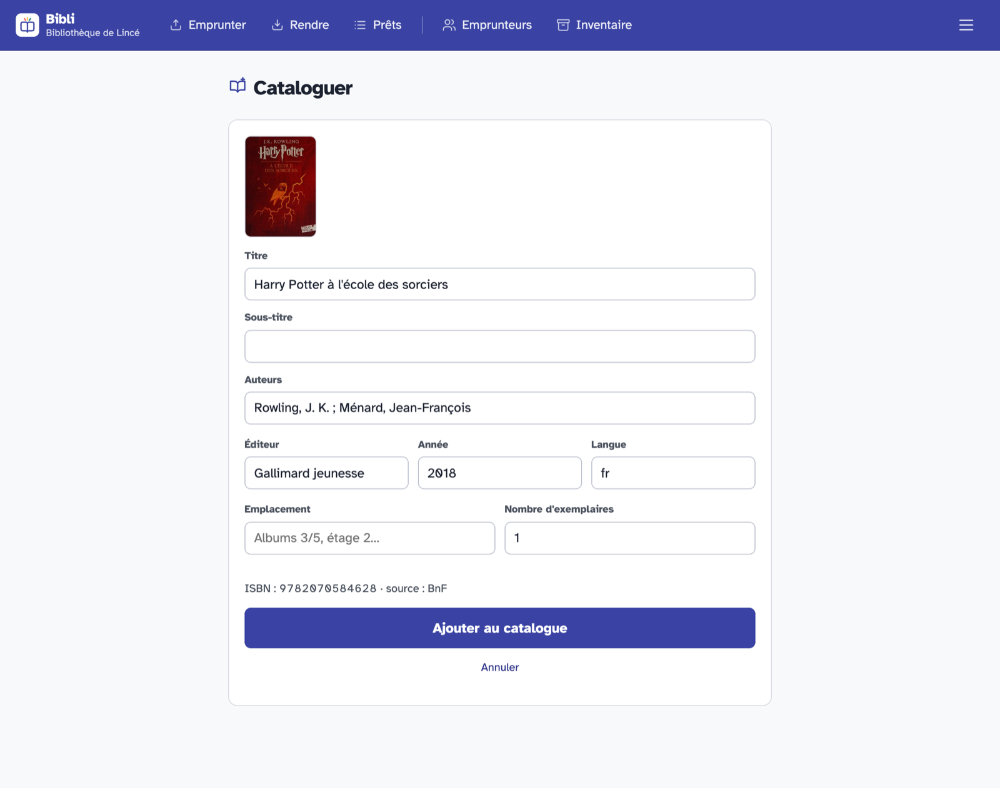
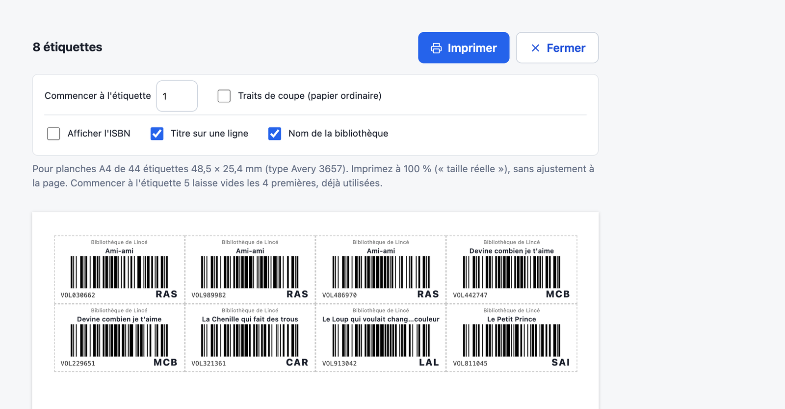
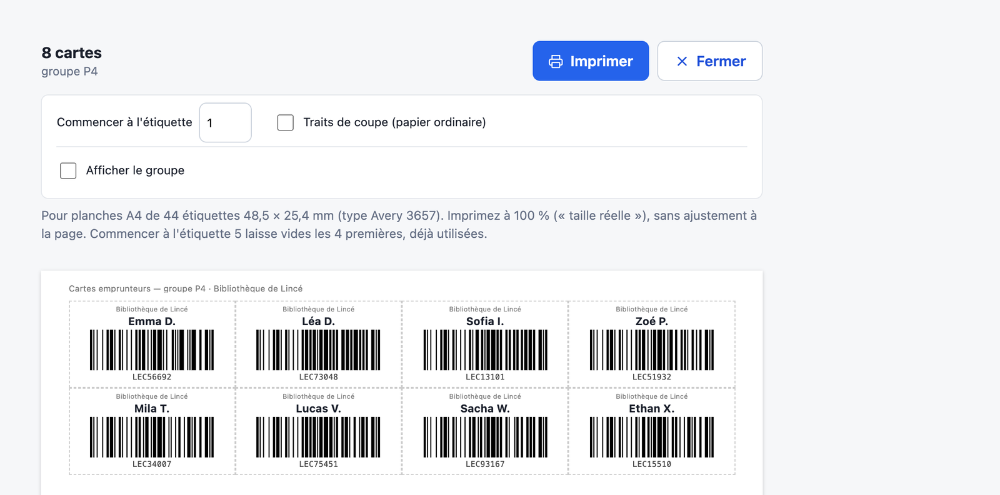
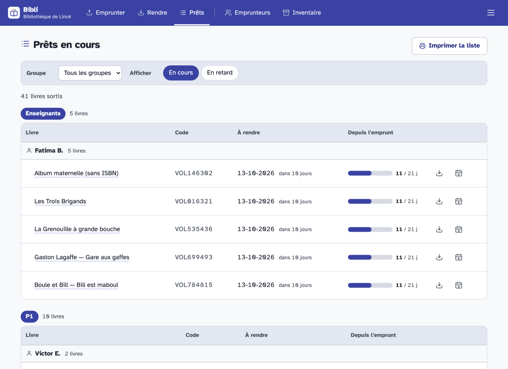
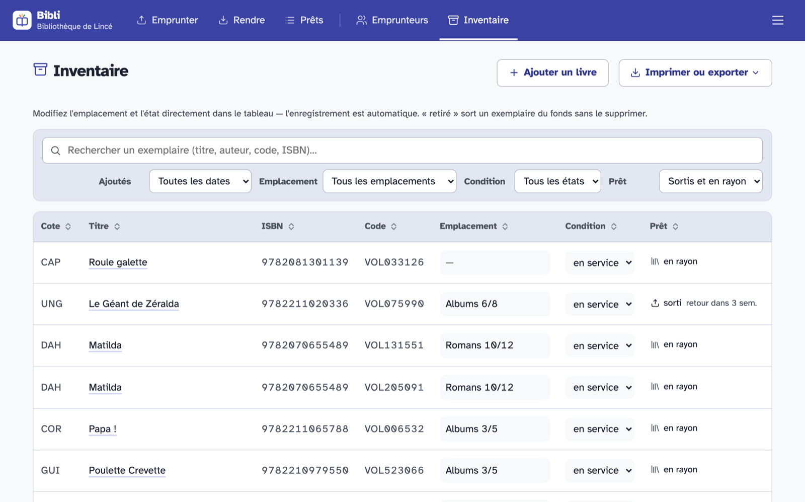

# Guide d'utilisation de Bibli

Ce guide s'adresse aux bénévoles qui tiennent la bibliothèque : prêter, rendre, cataloguer, gérer les emprunteurs. Pour installer Bibli sur un ordinateur, voir le [guide d'installation](installation.md). L'installation d'un serveur est décrite dans [Déployer un serveur](deployment.md).

Les captures d'écran viennent de l'instance de démonstration : l'école, les lecteurs et les prêts sont fictifs.

## Sommaire

1. [Premier jour](#1-premier-jour)
2. [Scanner les codes-barres](#2-scanner-les-codes-barres)
3. [Au comptoir : prêter et rendre](#3-au-comptoir--prêter-et-rendre)
4. [Cataloguer les livres](#4-cataloguer-les-livres)
5. [ISBN seul ou étiquettes ?](#5-isbn-seul-ou-étiquettes-)
6. [Les emprunteurs](#6-les-emprunteurs)
7. [Chaque mois, chaque année](#7-chaque-mois-chaque-année)
8. [Questions fréquentes](#8-questions-fréquentes)

## 1. Premier jour

Bibli tient le registre de la bibliothèque : quels livres la bibliothèque possède, qui en a emprunté, et pour quand ils doivent revenir. Tout se fait dans le navigateur, à la souris, au doigt sur une tablette, ou avec une **douchette** (lecteur de code-barres) qui tape le code à votre place et valide. La caméra d'un téléphone ou d'une tablette fait aussi l'affaire (voir [§2](#2-scanner-les-codes-barres)).

Le menu est en deux groupes :

- **Au comptoir** : *Emprunter* et *Rendre*, les deux écrans de tous les jours.
- **Gestion** : *Prêts* (ce qui est sorti, les retards), *Emprunteurs* (les lecteurs : élèves, résidents, membres, personnel…), *Inventaire* (tous les exemplaires), *Cataloguer* (ajouter des livres), *Statistiques* et *Réglages*.

Pour commencer une bibliothèque de zéro, dans l'ordre :

1. **Réglages** : le nom de l'établissement (il est imprimé sur les cartes et les étiquettes) et la durée de prêt (14 jours par défaut).
2. **Emprunteurs** : importer la liste des emprunteurs (voir [§6](#6-les-emprunteurs)), puis imprimer les cartes.
3. **Cataloguer** : scanner les livres. Pas besoin de tout cataloguer avant d'ouvrir : un livre inconnu scanné au comptoir peut être ajouté sur-le-champ.
4. Décider si l'on colle des étiquettes (voir [§5](#5-isbn-seul-ou-étiquettes-)). On peut commencer sans et s'y mettre plus tard.

Deux codes circulent dans Bibli :

- **L'ISBN**, imprimé en code-barres au dos de presque tous les livres récents (commence par 978 ou 979).
- **Le code interne**, créé par Bibli : `VOL` suivi de chiffres pour un exemplaire (`VOL204572`), `LEC` suivi de chiffres pour une carte d'emprunteur (`LEC73048`). Il est imprimé sur les étiquettes et les cartes.

## 2. Scanner les codes-barres

Trois moyens de lire un code-barres, qui peuvent cohabiter : une douchette au comptoir, une tablette pour cataloguer dans les rayons, un téléphone en dépannage. Dans tous les cas, Bibli reçoit la même chose : les chiffres du code, comme si on les avait tapés.

| | Douchette USB | Douchette Bluetooth | Caméra du téléphone ou de la tablette |
| --- | --- | --- | --- |
| Achat | 25 à 40 € | un peu plus cher | rien |
| Vitesse | un geste par livre | un geste par livre | viser, attendre une seconde |
| Branchement | un câble sur l'ordinateur | appairage, puis sans fil | aucun |
| Condition | aucune | aucune | Bibli ouvert en `https://` |
| Idéal pour | le comptoir, les séances chargées | une tablette au comptoir, se déplacer dans les rayons | dépanner, cataloguer un carton, une petite bibliothèque |

Pour une bibliothèque qui prête à tout un groupe d'un coup, la douchette fait gagner beaucoup de temps. La caméra suffit pour démarrer.

### La douchette USB

Une douchette se comporte comme un **clavier** : elle tape les chiffres du code puis appuie sur Entrée. Aucun pilote à installer, aucun réglage dans Bibli. Sur les écrans *Emprunter*, *Rendre* et *Cataloguer*, le champ de scan est déjà sélectionné : il suffit de scanner. Si on a cliqué ailleurs, cliquer d'abord dans le champ.

**Premier essai, à faire une fois** : ouvrir un éditeur de texte (Bloc-notes, TextEdit), scanner l'ISBN d'un livre, puis une étiquette ou une carte.

- On doit voir `9782070612758` (par exemple), puis un passage à la ligne. Tout va bien.
- On voit `çà&é"'(`… à la place des chiffres : la douchette est réglée en clavier américain (QWERTY) alors que l'ordinateur est en belge ou français (AZERTY). Dans le mode d'emploi de la douchette, scanner le code de configuration « Belgique » ou « France » (AZERTY).
- Les chiffres s'affichent mais sans passer à la ligne : activer le suffixe « Entrée » (CR, *Enter*) dans le mode d'emploi. Sinon il faut appuyer sur Entrée après chaque scan.
- Les livres passent mais pas les étiquettes ni les cartes : activer le **Code 128** dans le mode d'emploi. Les livres utilisent l'EAN-13, les étiquettes et les cartes de Bibli le Code 128. Presque toutes les douchettes lisent les deux d'origine.

À l'achat, un modèle d'entrée de gamme suffit, pourvu qu'il lise l'EAN-13 et le Code 128.

### La douchette Bluetooth

C'est la même chose sans fil. Elle s'appaire comme un clavier Bluetooth (mode « HID » dans son mode d'emploi), avec l'ordinateur, la tablette ou le téléphone. Certaines sont livrées avec un petit récepteur USB, qui s'utilise alors comme une douchette USB.

- **Même essai** que pour la douchette USB, et même réglage du clavier (AZERTY).
- **Sur une tablette ou un téléphone**, l'appareil la prend pour un clavier physique : le clavier à l'écran peut ne plus apparaître. Pour taper un titre ou un nom, éteindre la douchette le temps de la saisie.
- **Mise en veille** : après quelques minutes sans servir, elle s'endort, et le premier scan ne fait parfois que la réveiller. Si rien n'apparaît, rescanner.
- **Mode « inventaire » ou « stockage »** : certaines douchettes peuvent garder les codes en mémoire pour les envoyer plus tard. Ne pas l'utiliser avec Bibli : chaque prêt et chaque retour doit être vu à l'écran au moment du scan.
- Penser à la **recharger** : une douchette vide en pleine séance, c'est la saisie à la main.

### La caméra du téléphone ou de la tablette

À côté de chaque champ de scan, un bouton en forme d'appareil photo ouvre la caméra.

1. Toucher le bouton. La première fois, le navigateur demande l'autorisation d'utiliser la caméra : accepter.
2. Viser le code-barres : à une quinzaine de centimètres, bien à plat, bien éclairé, les barres à l'horizontale et qui remplissent le cadre.
3. Dès qu'il est lu, la caméra se ferme et Bibli continue tout seul, comme avec une douchette (le téléphone vibre, sur Android).

Elle lit l'ISBN des livres, les étiquettes et les cartes, et ignore le petit code du prix à côté de l'ISBN. L'image est décodée sur l'appareil : rien n'est envoyé nulle part.

Si rien n'est lu après quelques secondes, Bibli le dit : rapprocher ou éloigner un peu, éviter les reflets d'une couverture brillante, ou fermer et taper les chiffres.

« **Caméra indisponible** » :

- avec `NotAllowedError` : l'autorisation a été refusée. La rétablir dans les réglages du navigateur pour l'adresse de Bibli ;
- sinon, le plus souvent, l'adresse de Bibli commence par `http://` et non `https://` : les navigateurs n'ouvrent la caméra que sur une adresse sécurisée. C'est un choix d'installation, à voir avec la personne qui a installé Bibli. En attendant, une douchette Bluetooth fonctionne sans condition.

Sur un ordinateur portable, la webcam fait mal la mise au point de près : une douchette est plus fiable.

## 3. Au comptoir : prêter et rendre

### Prêter

1. Ouvrir **Emprunter**.
2. **Scanner la carte** de l'emprunteur. Sans carte, taper son groupe et le début de son prénom (« P1 ag ») et choisir dans la liste.
3. **Scanner les livres** un par un : l'ISBN au dos ou le code de l'étiquette, au choix. Ils s'ajoutent au panier. Un livre ajouté par erreur se retire avec « Retirer ».
4. **Confirmer une seule fois** pour tout le panier. L'écran affiche la date de retour, puis se remet en attente de la carte suivante.

Code-barres illisible ou étiquette décollée : taper quelques mots du titre ou le nom de l'auteur dans le même champ. Bibli propose les livres en rayon qui correspondent.

Avec l'ISBN, Bibli prend un exemplaire disponible de ce titre, n'importe lequel. Si tous sont déjà sortis, il le dit, et propose d'ajouter un exemplaire (quand la bibliothèque vient d'en acheter un de plus).

### Rendre

1. Ouvrir **Rendre**.
2. **Scanner le livre**. C'est tout : inutile de savoir qui l'avait.

Si **plusieurs exemplaires du même titre** sont sortis et qu'on scanne l'ISBN, Bibli ne peut pas deviner lequel revient : il affiche les emprunteurs et demande « qui rend le sien ? ». Avec une étiquette, la question ne se pose pas.

Un livre sans code-barres ni étiquette se rend depuis **Prêts** ou depuis la fiche de l'emprunteur, avec le bouton *Rendre* sur la ligne du prêt.

### Prolonger un prêt

Dans **Prêts** (ou sur la fiche de l'emprunteur), le bouton *Prolonger* sur la ligne du prêt demande le nombre de jours.

## 4. Cataloguer les livres

### Avec un ISBN (le cas normal)

1. Ouvrir **Cataloguer** et scanner l'ISBN au dos du livre.
2. Bibli interroge les catalogues (BnF, UniCat, Google Books, Open Library) et remplit la fiche : titre, auteurs, éditeur, année, couverture. **Seul l'ISBN sort de Bibli**, jamais une donnée d'emprunteur.
3. **Vérifier la couverture** : c'est le moyen le plus rapide de voir qu'on a scanné le bon livre. Corriger ce qui est faux, tout est modifiable.
4. Indiquer le **nombre d'exemplaires** (5 pour un lot destiné à un groupe) et, si on veut, un **emplacement** (« Albums 3/5 », « classe P3 »).
5. *Ajouter au catalogue*. Chaque exemplaire reçoit son code interne. Le bouton *Étiquettes (optionnel)* les imprime tout de suite.

Si le titre est déjà au catalogue, Bibli le signale : on ajoute alors des exemplaires au même livre, sans créer de doublon.

### Sans ISBN, ou livre introuvable

Environ un livre sur dix n'est trouvé dans aucun catalogue : albums jeunesse, petites maisons d'édition, livres anciens. La fiche reste à remplir à la main. Seul le titre est obligatoire.

Pour un livre sans aucun ISBN (livre ancien, fabriqué sur place, don sans code-barres), choisir **Saisie manuelle (livre sans ISBN)**. Ce livre n'a pas de code-barres : il lui faut une étiquette pour passer à la douchette (voir [§5](#5-isbn-seul-ou-étiquettes-)).

Quand les catalogues n'ont pas répondu (message « n'a pas répondu »), le livre existe peut-être : réessayer une minute plus tard avant de tout taper.

### Depuis le comptoir

Scanner au comptoir un livre absent du catalogue propose de le créer tout de suite, prérempli, et de le prêter dans la foulée. Pratique pour un livre qu'un membre de l'équipe apporte. Si les achats doivent passer par une seule personne, cette option se coupe dans **Réglages** → *Cataloguer depuis le comptoir*.

### Corriger une fiche

Depuis **Inventaire**, cliquer le titre pour ouvrir la fiche du livre. En haut, *Rangement* dit où il se range : sa cote, telle que l'étiquette l'imprime, et l'emplacement de ses exemplaires, modifiable ligne par ligne dans le tableau des exemplaires. Sur la fiche, *Modifier* change les informations, *Enrichir depuis l'ISBN* complète les champs vides et redemande la couverture, *Ajouter un exemplaire* crée un exemplaire de plus.

## 5. ISBN seul ou étiquettes ?

Bibli fonctionne **sans aucune étiquette** : on prête et on rend en scannant l'ISBN au dos du livre. Les étiquettes sont une option, et on peut en coller sur une partie de la collection seulement.

### Ce que l'étiquette ajoute

Une étiquette porte le **code interne** de l'exemplaire en code-barres, la **cote** en gros (pour ranger), le titre et, si on le souhaite, le nom de l'établissement et l'ISBN. Là où l'ISBN désigne un *titre*, le code interne désigne *un exemplaire précis*.

### Choisir

| Situation | ISBN seul | Étiquette |
| --- | --- | --- |
| Un seul exemplaire du titre, code-barres au dos | Suffit | Facultative |
| Plusieurs exemplaires du même titre (lot pour un groupe, série achetée en double) | Au retour, Bibli demande qui rend le sien | Recommandée : le retour est immédiat |
| Livre sans ISBN (ancien, fait sur place, don) | Impossible à scanner : il faut taper le titre au prêt et rendre depuis *Prêts* | **Nécessaire** |
| ISBN imprimé en chiffres mais sans code-barres | À taper à la main à chaque passage | Recommandée |
| On veut ranger les rayons par cote | Rien n'indique où va le livre | La cote est imprimée en gros |
| On veut qu'un livre égaré soit rapporté à la bibliothèque | Rien ne l'indique | Le nom de l'établissement est imprimé |
| On veut suivre l'état d'un exemplaire précis (abîmé, perdu) | On ne sait pas lequel des exemplaires identiques est lequel | Chaque exemplaire est reconnaissable |

### Notre conseil : commencer sans, étiqueter peu à peu

1. **Au démarrage**, cataloguez et prêtez à l'ISBN. La bibliothèque tourne dès le premier jour.
2. **Étiquetez d'abord** les livres sans code-barres et les titres en plusieurs exemplaires : ce sont eux qui posent problème au comptoir.
3. **Le reste**, au fil des séances de rangement, si l'équipe veut ranger par cote ou marquer les livres au nom de l'établissement.

Rien n'est à refaire le jour où l'on commence : chaque exemplaire a déjà son code interne depuis son catalogage, l'étiquette ne fait que l'imprimer. Un livre étiqueté se scanne ensuite indifféremment par son ISBN ou par son étiquette.

### La cote

La cote dit où ranger le livre. Bibli la calcule toute seule, selon la règle des bibliothèques pour les romans et les albums : **les trois premières lettres du nom du premier auteur**, en majuscules et sans accents.

- « Le Petit Prince », de Saint-Exupéry → **SAI**
- les « Fables » de La Fontaine → **LAF**
- un livre de Van Zeveren → **VAN**
- un livre sans auteur, « Anonyme » ou « Collectif » : les trois premières lettres du titre, sans l'article. « Le Roman de Renart » → **ROM**

Les livres d'un même auteur se retrouvent ainsi côte à côte, rangés par ordre alphabétique. La cote s'affiche sur la fiche du livre et dans une colonne de l'**Inventaire**.

La cote n'est pas saisie à la main : elle suit la fiche du livre. Si elle est fausse, c'est que le champ **Auteurs** l'est. Souvent, l'illustrateur a été placé en premier, ou le catalogue a écrit « Collectif ». Corrigez les auteurs sur la fiche (le premier nommé est celui qui compte, format « Nom, Prénom ; Nom, Prénom ») et la cote suit à la prochaine impression.

Pour regrouper des livres autrement que par auteur (documentaires, premières lectures, livres d'un groupe), utilisez l'**emplacement** de l'exemplaire (« bac documentaires », « classe P3 », « réserve »). Il se modifie directement dans le tableau de l'**Inventaire**, et l'inventaire se filtre par emplacement.

#### Exemple : ranger par âge, comme une bibliothèque communale

Beaucoup de bibliothèques jeunesse rangent d'abord par âge et par genre, avec une pastille de couleur sur le dos du livre : albums 0/3 ans, 3/5 ans, 6/8 ans, 8/10 ans, 10/12 ans, documentaires 3/5 ans… Bibli s'y prête sans réglage particulier :

1. **Un emplacement par groupe**, écrit toujours de la même façon : « Albums 0/3 », « Albums 3/5 », « Albums 6/8 », « Albums 8/10 », « Albums 10/12 », « Documentaires 3/5 ». Au catalogage, le champ *Emplacement* le donne à tous les exemplaires d'un coup. Pour les livres déjà catalogués, il se change dans le tableau de l'**Inventaire**.
2. **La cote range à l'intérieur du groupe** : dans le bac « Albums 3/5 », les livres se suivent par ordre alphabétique de cote, PEN (Pennart) avant PON (Ponti).
3. **Les pastilles de couleur** s'achètent à part, en papeterie, et se collent sur le dos. Les étiquettes de Bibli sont imprimées en noir et blanc : elles vont sur la couverture arrière, avec le code-barres et la cote. La pastille dit dans quel bac va le livre, la cote où il va dans ce bac.
4. **Affichez la légende** près des rayons, comme le font les bibliothèques : une feuille avec chaque pastille et son groupe, pour que chacun puisse ranger lui-même.

Dans l'**Inventaire**, choisir l'emplacement (« Albums 3/5 ») puis cliquer l'en-tête **Cote** donne la liste du bac dans l'ordre où les livres y sont rangés : de quoi le vérifier en passant le long du rayon, ou l'imprimer (*Imprimer ou exporter* → *Imprimer la liste*) et cocher au crayon.

### Imprimer les étiquettes

Trois chemins, selon le moment :

- **Juste après le catalogage** : le bouton *Étiquettes (optionnel)* imprime celles des exemplaires qu'on vient de créer. Pour un livre sans ISBN, il s'appelle *Imprimer les étiquettes* : l'étiquette y est nécessaire.
- **Depuis la fiche d'un livre** : *Imprimer cette étiquette*, ou *Imprimer les N étiquettes ajoutées aujourd'hui*.
- **Plusieurs à la fois, plus tard** : **Inventaire**, filtrer (par exemple *Ajoutés* → *7 derniers jours*, ou chercher un titre, un code, un ISBN), puis *Imprimer ou exporter* → *Imprimer N étiquettes*. Le nombre affiché permet de vérifier la sélection avant d'imprimer. Triée par date d'ajout (l'ordre par défaut), la planche sort **dans l'ordre de catalogage**, le premier livre catalogué en premier : les étiquettes se collent en reprenant la pile dans le même ordre. Triée par cote ou par titre, elle suit le tri de l'écran.

La planche est prévue pour les **planches A4 de 44 étiquettes autocollantes 48,5 × 25,4 mm** (4 colonnes × 11 lignes, type Avery Zweckform 3657 et compatibles).

- **Imprimez à 100 %** (« taille réelle »), jamais « ajuster à la page », sinon les étiquettes ne tombent plus sur les autocollants.
- **Avant d'acheter une boîte**, imprimez une page sur papier ordinaire et posez-la sur une planche devant une fenêtre : tout doit coïncider.
- **Planche déjà entamée** : *Commencer à l'étiquette* saute les cases déjà utilisées (commencer à 5 laisse vides les 4 premières).
- **Sans planche autocollante** : cochez *Traits de coupe* et imprimez sur papier ordinaire, à découper et coller.
- Les options *Nom de la bibliothèque*, *Afficher l'ISBN* et *Titre sur une ligne* se cochent sur la planche avant d'imprimer.

Collez l'étiquette sur la couverture arrière, **sans masquer le code-barres ISBN** : les deux restent utilisables.

## 6. Les emprunteurs

**Protection des données** : un emprunteur, c'est un prénom, l'initiale du nom et un groupe, rien d'autre. En tapant « Durant », Bibli ne garde que « D. ».

### Importer la liste des emprunteurs

**Emprunteurs** → *Gérer la liste* → *Importer des lecteurs (CSV)*.

- Coller la liste (colonnes **prénom, nom, groupe**) copiée depuis un tableur, ou choisir un fichier CSV.
- *Télécharger une feuille Excel vide* fournit un modèle à remplir, puis à copier-coller dans la zone.
- *Prévisualiser* montre ce qui sera créé. Les emprunteurs déjà enregistrés (même prénom, même initiale, même groupe) sont reconnus et ignorés : on peut réimporter la liste à jour (celle de l'administration, par exemple, à chaque nouvelle année) sans créer de doublons.

Le *groupe* sert à regrouper les emprunteurs : une classe, un étage, une unité de soins, un atelier, ou rien du tout. Le personnel peut avoir son propre groupe (« Enseignants », « Équipe »).

Une personne seule s'ajoute à la main avec *Ajouter*.

### Les cartes

*Imprimer les cartes de P3* (ou *Imprimer toutes les cartes*) produit des cartes à code-barres sur les mêmes planches de 44 autocollants que les étiquettes, à coller sur un carton ou dans un cahier.

Astuce : imprimée sur papier ordinaire et non découpée, la page d'un groupe devient une **feuille de groupe** à garder au comptoir. On y scanne la carte d'un emprunteur qui a oublié la sienne.

### Un emprunteur qui part

*Désactiver* le retire de la liste sans effacer son historique. C'est réversible depuis *Voir les inactifs*. Un emprunteur qui a encore des livres ne peut pas être désactivé : les rendre d'abord, ou les déclarer perdus.

### Le lien de suivi

Dans la colonne *Lien de suivi* : *Créer le lien*, puis *Copier le lien*, et le transmettre à l'emprunteur ou à ses proches comme on veut (un mot écrit, un message). La page montre les livres en cours et leur date de retour, avec le prénom de l'emprunteur et le nom de l'établissement, rien d'autre. Rien n'est envoyé par Bibli. *Révoquer* ou *Régénérer* coupe l'ancien lien.

Sur les applications Mac, Windows et Linux, cette colonne n'apparaît pas : Bibli n'y est joignable que depuis l'ordinateur de la bibliothèque.

## 7. Chaque mois, chaque année

### Les retards

**Prêts** → onglet *En retard*. *Imprimer les retards* donne une liste groupée par groupe, à déposer dans chaque groupe.

### Les livres perdus, abîmés ou retirés

Dans l'**Inventaire**, la colonne *Condition* de chaque exemplaire : *disponible*, *abîmé*, *perdu*, *retiré du fonds*. Le changement est enregistré tout de suite.

- **Perdu** ou **retiré** clôture le prêt en cours : le livre disparaît des retards.
- Un livre perdu qui réapparaît est reconnu à l'écran **Rendre**, qui propose *Remettre en service*.
- Un livre déjà emprunté ne peut plus être supprimé (son historique compte) : on le **retire** du fonds à la place.

### L'inventaire

**Inventaire** liste tous les exemplaires, avec recherche et filtres (emplacement, état, sorti ou en rayon, date d'ajout). Chaque en-tête de colonne trie la liste ; trier par **Cote** donne l'ordre des rayons. *Imprimer ou exporter* → *Imprimer la liste* donne une liste papier à cocher en passant dans les rayons. *Exporter en Excel* donne le même tableau pour un tableur.

### Le bilan de l'année

**Statistiques** montre les prêts de l'année, les livres les plus empruntés et ceux qui ne sont jamais sortis. Le **Bilan du fonds** (*Télécharger le tableur*) donne une ligne par titre, dans l'ordre des cotes : de quoi décider ce qu'on déplace, rachète ou retire. Il ne nomme personne.

### Passage d'année

**Emprunteurs** → *Gérer la liste* → *Passer à l'année suivante*, une fois par an (surtout utile dans une école ou toute structure qui fonctionne par années), avant d'importer les nouveaux emprunteurs.

1. Pour chaque groupe dont le nom contient un nombre, le nouveau groupe est prérempli (P3 → P4). Vérifier, corriger au besoin.
2. Pour le dernier groupe de chaque cycle (P6, M3…), cocher **sortants** : ces emprunteurs seront désactivés.
3. Relire le tableau, puis *Appliquer le passage d'année*. **Il n'y a pas de retour arrière en un clic.**

Un sortant qui a encore des livres reste actif, et le bilan le signale. Ensuite, importer la liste des nouveaux emprunteurs (voir [§6](#6-les-emprunteurs)).

### La sauvegarde

**Réglages** → *Sauvegarde* indique la date de la dernière sauvegarde automatique. Elle doit dater de moins de 24 heures. En cas d'échec, prévenir la personne qui a installé Bibli.

*Télécharger une sauvegarde* enregistre une copie complète. Gardez-en une régulièrement hors du bâtiment, par exemple sur une clé USB, et traitez-la comme le registre de la bibliothèque : elle contient la collection et la liste des emprunteurs.

## 8. Questions fréquentes

**La douchette ne lit pas le code-barres.**
Rapprocher ou éloigner un peu le livre, incliner légèrement. Sinon, taper l'ISBN (les chiffres sous le code-barres) ou quelques mots du titre dans le même champ.

**La douchette tape `&é"'(` ou des caractères bizarres au lieu des chiffres.**
Elle est réglée en clavier QWERTY sur un ordinateur AZERTY. Voir [La douchette USB](#la-douchette-usb).

**La douchette lit un petit code-barres à côté de l'ISBN.**
C'est le code du prix (5 chiffres) : il ne sert pas à Bibli. Viser le grand code-barres de l'ISBN.

**« n'est pas un code valide : un chiffre a été mal lu ou mal tapé ».**
Bibli vérifie chaque code. Rescanner, ou retaper en vérifiant les chiffres.

**J'ai prêté le mauvais livre.**
Le rendre tout de suite (écran **Rendre**), puis refaire le prêt.

**Un emprunteur a oublié sa carte.**
Au prêt, taper son groupe et le début de son prénom (« P3 lé »). Ou scanner sa carte sur la feuille de groupe (voir [§6](#6-les-emprunteurs)).

**Au retour, Bibli me demande qui rend le livre.**
Plusieurs exemplaires du même titre sont sortis et l'ISBN ne dit pas lequel revient. Choisir l'emprunteur qui le rapporte. Pour ne plus avoir la question, étiqueter ces exemplaires (voir [§5](#5-isbn-seul-ou-étiquettes-)).

**« tous les exemplaires sont déjà empruntés », alors que j'ai le livre en main.**
Soit un retour a été oublié (le rendre d'abord, puis le prêter), soit c'est un exemplaire que la bibliothèque n'a jamais catalogué : *Ajouter un exemplaire et l'emprunter*.

**Une étiquette s'est décollée.**
**Inventaire** : chercher le titre, puis *Imprimer ou exporter* → *Imprimer N étiquettes*. Ou, depuis la fiche du livre, *Imprimer cette étiquette*.

**Les étiquettes imprimées ne tombent pas sur les autocollants.**
L'impression n'était pas à 100 %. Dans la fenêtre d'impression, choisir « taille réelle » ou « 100 % », et désactiver « ajuster à la page ».

**La cote d'un livre est bizarre.**
Elle vient du premier auteur de la fiche. Corriger le champ *Auteurs* (voir [La cote](#la-cote)).

**La couverture affichée n'est pas la bonne, ou manque.**
Sur la fiche du livre, *Enrichir depuis l'ISBN* la redemande. Beaucoup d'albums n'ont de couverture dans aucun catalogue : ce n'est pas grave, le prêt fonctionne sans.

**Un livre déclaré perdu est retrouvé.**
Le scanner à l'écran **Rendre** : *Remettre en service*.

**Deux emprunteurs ont le même prénom et la même initiale dans le même groupe.**
L'import les prend pour un doublon. Cocher *Importer aussi le doublon* s'il s'agit vraiment de deux personnes, et vérifier leurs cartes.

**Que deviennent les données d'un emprunteur parti ?**
Après la durée de conservation (3 ans par défaut, dans **Réglages**), ses prêts passés ne sont plus rattachés à lui, et il perd prénom, groupe et carte. Les livres gardent leur nombre d'emprunts.

**On nous a donné un carton de livres.**
**Cataloguer**, un livre après l'autre. Ceux qui sont déjà au catalogue s'ajoutent comme exemplaires supplémentaires. Puis, si on étiquette : **Inventaire** → *Ajoutés* → *Aujourd'hui* → *Imprimer N étiquettes*.
