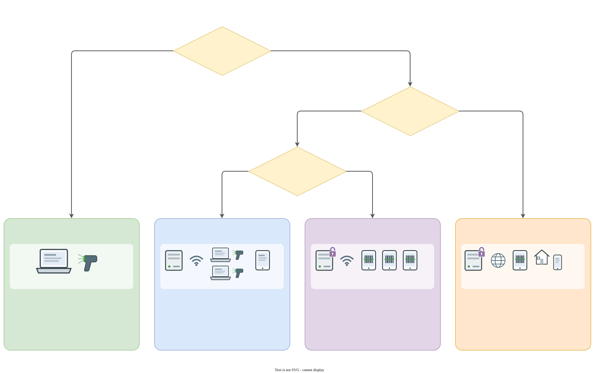

# Installer Bibli sur un ordinateur

Ce guide s'adresse à la personne qui installe Bibli, seule, sur **un ordinateur de la bibliothèque** : un Mac, un PC Windows ou un PC Linux. Aucune connaissance technique n'est nécessaire. Une fois Bibli installé, le [guide d'utilisation](guide.md) prend le relais.

Pour plusieurs postes, des tablettes ou un accès depuis la maison, il faut un serveur : voir [Quand passer au serveur](#quand-passer-au-serveur).

## Sommaire

1. [Télécharger](#1-télécharger)
2. [Installer et lancer la première fois](#2-installer-et-lancer-la-première-fois)
3. [Tous les jours : ouvrir et quitter](#3-tous-les-jours--ouvrir-et-quitter)
4. [Où sont les données](#4-où-sont-les-données)
5. [Sauvegarder](#5-sauvegarder)
6. [Changer d'ordinateur ou restaurer une sauvegarde](#6-changer-dordinateur-ou-restaurer-une-sauvegarde)
7. [Mettre à jour, désinstaller](#7-mettre-à-jour-désinstaller)
8. [Mot de passe oublié](#8-mot-de-passe-oublié)
9. [Quand passer au serveur](#quand-passer-au-serveur)

## Ce qu'il faut

- Un ordinateur qui reste à la bibliothèque : Mac, PC Windows 10 ou 11 (pas Windows 7, 8 ni 8.1, où Bibli ne démarre pas), ou PC Linux (un Raspberry Pi récent convient aussi).
- Un navigateur **Chrome**, **Edge**, **Brave** ou **Chromium**. Edge est déjà installé sur Windows. Bibli s'ouvre alors dans une fenêtre à lui, sans onglets ni barre d'adresse. Sans aucun de ces navigateurs, Bibli s'ouvre dans le navigateur habituel, dans un onglet.
- Une connexion Internet, pour télécharger Bibli, puis pour retrouver les fiches des livres au catalogage. Prêter et rendre fonctionnent sans Internet.
- Si possible, une douchette (voir [Scanner les codes-barres](guide.md#2-scanner-les-codes-barres)).

## 1. Télécharger

Ouvrir la [page de la dernière version de Bibli](https://github.com/tintamarre/bibli/releases/latest) et télécharger, dans la liste des fichiers :

| Ordinateur | Fichier |
| --- | --- |
| Mac | `Bibli-vX.Y.Z-macos.zip` |
| Windows | `Bibli-vX.Y.Z-windows.exe` |
| Linux | `Bibli-vX.Y.Z-linux.tar.gz` |

`X.Y.Z` est le numéro de version, par exemple `1.4.0`.

## 2. Installer et lancer la première fois

Au premier lancement, Bibli demande de **choisir le mot de passe de la bibliothèque**. C'est lui qu'on tapera pour se connecter. Choisissez-le, notez-le en lieu sûr, et donnez-le aux bénévoles.

Ni Apple ni Microsoft n'ont signé Bibli : c'est un logiciel libre, distribué sans passer par eux. L'ordinateur affiche donc un avertissement la première fois. Les étapes ci-dessous le franchissent une fois pour toutes.

### Sur un Mac

1. Ouvrir le fichier `.zip` téléchargé (double-clic dans *Téléchargements*) : il donne `Bibli.app`.
2. Glisser `Bibli.app` dans le dossier **Applications**.
3. Double-cliquer sur Bibli. macOS refuse : « Bibli ne peut pas être ouvert, car Apple ne peut pas le vérifier ». Cliquer **OK** (ou *Terminé*).
4. Ouvrir **Réglages Système** → **Confidentialité et sécurité**. Tout en bas, une ligne dit que « Bibli » a été bloqué : cliquer **Ouvrir quand même**, puis confirmer avec le mot de passe du Mac.

5. Relancer Bibli, et cliquer **Ouvrir** dans la dernière fenêtre d'avertissement. Sur les anciennes versions de macOS, un clic droit sur Bibli → **Ouvrir** suffit pour franchir ces étapes.
6. Bibli demande le mot de passe de la bibliothèque (voir plus haut), puis ouvre sa fenêtre.

### Sur Windows

1. Double-cliquer sur le fichier `.exe` téléchargé (dans *Téléchargements*).
2. Windows peut afficher « Windows a protégé votre ordinateur » (SmartScreen). Cliquer **Informations complémentaires**, puis **Exécuter quand même**.
3. Bibli demande comment l'utiliser sur ce PC : choisir **Seulement sur ce PC**. Aucun droit d'administrateur n'est nécessaire.
4. Bibli demande le mot de passe de la bibliothèque, puis ouvre sa fenêtre dans Edge.
5. Un raccourci **Bibli** est posé sur le Bureau et dans le menu Démarrer : c'est lui qu'on utilisera ensuite. Le fichier téléchargé ne sert plus et peut être supprimé.

Les deux autres choix servent à une organisation qui a un serveur : **Serveur pour plusieurs appareils** l'installe sur ce PC (voir [Windows (service)](deployment.md#windows-service)), **Autre poste** pose seulement un raccourci vers un serveur installé ailleurs.

### Sur Linux

1. Extraire l'archive `.tar.gz` dans le dossier **Documents** (clic droit → *Extraire ici*). On obtient un dossier `Bibli`.
2. Clic droit dans ce dossier → **Ouvrir dans un terminal**, puis taper `./bibli.sh` et Entrée. Le premier lancement se fait ainsi : la plupart des gestionnaires de fichiers ne lancent plus un programme au double-clic.
3. Bibli demande le mot de passe de la bibliothèque, puis ouvre sa fenêtre.
4. Bibli est ajouté au **menu des applications** : c'est lui qu'on utilisera ensuite. Ne pas déplacer ni supprimer le dossier `Bibli`.

### Ensuite

Se connecter avec le mot de passe choisi, puis suivre le [premier jour](guide.md#1-premier-jour) du guide d'utilisation : nom de la bibliothèque, liste des emprunteurs, premiers livres.

## 3. Tous les jours : ouvrir et quitter

- **Ouvrir** : Bibli dans *Applications* (Mac), le raccourci du Bureau ou du menu Démarrer (Windows), le menu des applications (Linux).
- **Quitter** : fermer la fenêtre de Bibli (sur Mac, **Cmd+Q**). Cela arrête Bibli.
- **Si Bibli s'est ouvert dans un onglet** du navigateur habituel (Mac, Linux) (aucun des navigateurs cités plus haut n'est installé), fermer l'onglet ne l'arrête pas. Relancer Bibli propose alors de l'arrêter.

Bibli ne fonctionne que tant que sa fenêtre est ouverte, et seulement sur cet ordinateur : aucune tablette, aucun autre poste ne peut l'atteindre.

## 4. Où sont les données

Toute la bibliothèque (livres, emprunteurs, prêts) tient dans **un dossier**, à part de l'application :

| Ordinateur | Dossier |
| --- | --- |
| Mac | `~/Library/Application Support/Bibli` (dans le Finder : menu *Aller* → *Aller au dossier…*, puis coller ce chemin) |
| Windows | `%LOCALAPPDATA%\Bibli` (coller ce chemin dans la barre d'adresse de l'Explorateur) |
| Linux | `~/.local/share/bibli` (dossier caché : Ctrl+H l'affiche dans le gestionnaire de fichiers) |

On y trouve :

- `biblio.db` : **la bibliothèque elle-même**, en un seul fichier ;
- `backups` : les sauvegardes automatiques ;
- `password` : le mot de passe de la bibliothèque ;
- `cache` : les couvertures de livres déjà téléchargées (peut être vidé sans rien perdre) ;
- `browser` : les réglages de la fenêtre de Bibli ;
- `bibli.log` : le journal, utile en cas de problème.

Ce dossier appartient à la session de l'ordinateur où Bibli a été installé. Si plusieurs personnes ont chacune leur session, installez et utilisez Bibli toujours depuis la même.

## 5. Sauvegarder

Toute la bibliothèque est un seul fichier sur un seul disque. Si l'ordinateur est volé, tombe en panne ou est réinstallé, sans sauvegarde ailleurs, tout est perdu.

**Automatiquement**, Bibli vérifie une minute après chaque lancement, puis toutes les heures, s'il lui manque la sauvegarde du jour, et la fait : un ordinateur resté en veille la rattrape à son réveil. Il en garde une par jour de la semaine, une par semaine sur 4 semaines et une par mois sur 4 mois, dans le dossier `backups`. Mais ces sauvegardes sont **sur le même ordinateur** : elles protègent d'une erreur de saisie, pas d'une panne.

**À la main, au moins une fois par mois** (et avant les vacances) :

1. Dans Bibli, ouvrir **Réglages** → *Sauvegarde*. Vérifier la date de la dernière sauvegarde.
2. Sous *Télécharger une sauvegarde*, cliquer la plus récente. Le fichier arrive dans *Téléchargements*, nommé d'après sa date (`biblio-2026-09-30.db`).
3. Copier ce fichier **hors de l'ordinateur** : une clé USB rangée dans le bâtiment, le disque partagé de l'établissement.

Ce fichier contient la liste des emprunteurs : rangez la clé comme le registre de la bibliothèque, pas dans un tiroir ouvert.

## 6. Changer d'ordinateur ou restaurer une sauvegarde

**Changer d'ordinateur**, depuis le même système (Mac vers Mac, par exemple) ou non :

1. Sur l'ancien ordinateur, télécharger une sauvegarde récente (voir [§5](#5-sauvegarder)) et la copier sur une clé USB.
2. Sur le nouveau, installer Bibli (voir [§2](#2-installer-et-lancer-la-première-fois)) et le lancer une fois, pour qu'il crée son dossier de données. Choisir le mot de passe, puis **quitter** Bibli.
3. Restaurer la sauvegarde, comme ci-dessous.

**Restaurer une sauvegarde** (même ordinateur ou nouveau) :

1. **Quitter Bibli** (fermer sa fenêtre). Ne jamais remplacer le fichier pendant que Bibli tourne.
2. Ouvrir le dossier des données (voir [§4](#4-où-sont-les-données)).
3. Si les fichiers `biblio.db-wal` et `biblio.db-shm` s'y trouvent, les supprimer.
4. Renommer l'actuel `biblio.db` en `biblio-ancien.db`, par précaution.
5. Copier la sauvegarde dans le dossier et la renommer **`biblio.db`**.
6. Relancer Bibli : la bibliothèque est revenue à la date de la sauvegarde. Tout ce qui a été fait depuis (prêts, retours, livres ajoutés) est à refaire.

Le mot de passe n'est pas dans la sauvegarde : sur un nouvel ordinateur, c'est celui choisi au premier lancement.

## 7. Mettre à jour, désinstaller

**Mettre à jour** : quitter Bibli, télécharger la nouvelle version (voir [§1](#1-télécharger)) et remplacer l'ancienne :

- Mac : glisser le nouveau `Bibli.app` dans *Applications*, et accepter de remplacer l'ancien.
- Windows : double-cliquer sur le nouveau `.exe` et choisir de nouveau **Seulement sur ce PC**. Si une ancienne version avait été extraite dans un dossier `Bibli` de Documents, ce dossier ne sert plus et peut être supprimé.
- Linux : extraire la nouvelle archive au même endroit que l'ancienne (Documents), et accepter de remplacer les fichiers du dossier `Bibli`.

Les données ne sont pas dans l'application : elles restent. Par prudence, téléchargez une sauvegarde juste avant.

**Désinstaller** :

- supprimer l'application (`Bibli.app` sur Mac ; sous Windows *Paramètres → Applications → Bibli → Désinstaller* ; sous Linux le dossier `Bibli` de Documents) : les données restent ;
- supprimer **aussi** le dossier des données (voir [§4](#4-où-sont-les-données)) efface toute la bibliothèque. Faites d'abord une sauvegarde si elle peut encore servir.

## 8. Mot de passe oublié

Pour retrouver l'accès ou changer le mot de passe :

1. Quitter Bibli.
2. Dans le dossier des données (voir [§4](#4-où-sont-les-données)), supprimer le fichier **`password`**.
3. Relancer Bibli : il demande un nouveau mot de passe. Les livres, les emprunteurs et les prêts ne sont pas touchés.

## Quand passer au serveur

La version pour un ordinateur convient à une bibliothèque tenue à un seul poste. Il faut installer Bibli sur un serveur, avec l'aide de quelqu'un d'à l'aise avec l'informatique, quand :

- **plusieurs postes** doivent prêter en même temps (deux comptoirs, une personne qui catalogue pendant qu'on prête) ;
- on veut **scanner avec des tablettes ou des téléphones**, par exemple dans les rayons ;
- l'ordinateur de la bibliothèque **rentre à la maison le soir**, ou sert à d'autres choses et n'est pas toujours là ;
- on veut donner aux emprunteurs ou à leurs proches le **lien de suivi** des livres empruntés, qui n'existe pas dans la version pour un ordinateur.

Il y a quatre façons d'installer Bibli. Ce guide couvre la première ; les trois autres demandent un petit ordinateur toujours allumé (mini PC) ou un serveur, et quelqu'un pour l'installer.

| Installation | Pour qui | Ce qu'elle permet | Ce qu'elle ne permet pas |
| --- | --- | --- | --- |
| **Application pour un ordinateur** (ce guide) | une bibliothèque, un poste | tout, avec une douchette ou la webcam ; rien d'autre à installer | aucun autre appareil ; fermer la fenêtre arrête Bibli |
| **Serveur sur le réseau local** (`http://`) | plusieurs postes | plusieurs ordinateurs en même temps, toujours allumé, douchettes USB et Bluetooth | pas de caméra des tablettes (elle exige `https://`) |
| **Serveur sur le réseau local, en `https://`** | plusieurs postes et des tablettes | tout ce qui précède, plus la caméra des tablettes et des téléphones | rien depuis la maison |
| **Serveur sur Internet** | la bibliothèque et ses lecteurs à la maison | partout, caméra comprise, et le lien de suivi | demande un nom de domaine, un hébergement, un mot de passe solide et des mises à jour suivies |

Dans les quatre cas, Bibli fonctionne pareil : un seul fichier de données, des sauvegardes automatiques, un mot de passe pour la bibliothèque.

Le passage garde tout : la sauvegarde téléchargée depuis *Réglages* se restaure sur le serveur. L'installation d'un serveur est décrite dans [Déployer un serveur](deployment.md).
